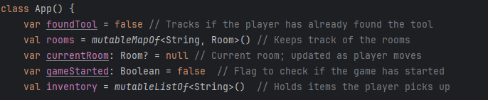
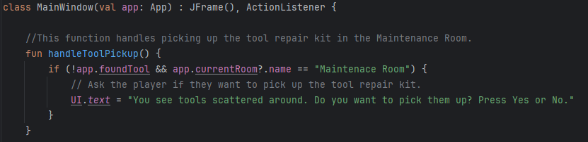

# Results of Testing

The test results show the actual outcome of the testing, following the [Test Plan](test-plan.md)

---

## Test Name: Movement 

In this test im going to see if i can make the player move from room to room 
### Data used: MutableMapOfString

I am going to use this to generally shape my map and then im going to use north, south, east and west for me to call it easily and move my player. 
I am also going to add more stuff which maybe make my game feel a bit better. I will write in this test result again after 2 weeks days   

### Test Result

In the top image you can see that using mutableListOfString which allows me to keep track of my rooms.
The image also has other variable like gamestarted which help me make it so that i can start the game when the player presses a 
certain button while the current room lets me connect rooms while updatng the players position. As for the inventory val it is just a reminder for 
me to make the game a bit more interesting. 

In the image above the code you see is just room code which holds some dialogue info which i will use to create atmosphere to 
my game.

In this image i connected my rooms using north, south, east and west which allowed me to move the player from these rooms 
while the bottom shows that it saves the rooms on my map. At the last line of code i set the crew quarters as my starting room

In this image i made an if statement in my update view which from the first image i told that was going to use the gamestarted 
which allowed me to make a title screen and that code basically says that if the game hasnt started put the Ui.text else put me 
in the current room which was the crewquarters while also putting the room description with it.

After that i used the yes button as the starting button for my games and also used it to enable my buttons because i had a 
problem that if the user pressed the movement buttons the game would just start so fixed it with this method.

Here you can see i just linked up my movement buttons to the rooms so that they can move the player around.

For me to make the player move i created a private func which i made it so that the rooms changed upon clicking one of the 
movement buttons. After that i created a first visit value which will allow me to make a second description telling the player that 
he visited that room already.

This is the function which was called in my yes buttons. This only enables my buttons back.

This image is just to show that i had to disable my buttons from the private func class which allowed me to make the buttons

---

### After writing all those line of code this was the result of me testing it to see if it worked:

This image shows my whole game ui and how it looks and as you can see the title of my game worked. You can also see that i 
added custom buttons using images.

In the second image we can see that the movement buttons was enabled after pressing yes but the title didnt switch to first room 
of the game. Which i will fix in the third week of testing.

In the third image i just pressed the movement buttons and as previously stated the player moved to the next room which was 
called the entrance. This means that my player moved from the crewqaurters to entrance but i went ahead and took screenshots 
of my player moving from section_1 to entrance again.

As i stated in the third image the fourth image shows that the player moved south which is where my room was.

For image five this was unexpected because when i went back to the room called entrance the room description didnt pop this 
means that movement func wasnt putting the room description back up. This will be fixed in the last day of week 3. I will also show how my player keeps inbound of my map.

Image six is just to show that i am standing in the room the next image will show you how my player stays inbound

In image seven i coded it that if the user presses one of the movebuttons that isnt connected to one of the rooms it would just 
say you can't go tha way

---

## Item pickup and second dialogue for rooms

In this test i made it so that when my character enters a certain room he can pick or search the room for a item. i will also make it so that when the player enters the room a second time new dialogue pops up. 

### MutableListOfString and some classes

Im going to use this data to make it so that if the player searches a room he gets a tool and that gets added to his "inventory" 
and make some class statements to make it so that when the player first visits it shows original dialogue but if enters again new dialogue show up.
### Test Result

In this image which i forgot to show in my previous test result but i added a first visited var to check if the player has visited that 
room.

In this image you can see nothing really has change since the last test result but i have added a val called inventory which then 
later on gets a func which will detect if the player is in the room and make them able to search it for tools or items

In my mainclass window i have added a func which allowed me to make it so that when the player enters the room called 
Maintenance he will be able to search it by pressing yes and it will show dialogue with it to show the user what to do.

In my update view i have added some things such as where previously the player would enter the room again but show nothing 
but i added a val statement for my item pickup which makes it so that when the player pressed yes dialogue would pop up and if he 
pressed no nothing would happen and the no buttons one dialogue would show up which was "you continue on your journey"

In image 5 i have added a end game screen which will congratulate the player on his\her escape.

On my previous image of my yes button i only had the game start, enablemovementbuttons and currentroom but i have added a 
few things where i previously stated that if my player was in the maintenance the code would first check to see if he was in the room
then if the player pressed yes it would then pop up the dialogue of the scatter tools and then say tools added to inventory and
the app.inventory would put tools in the mutableListOfStrings.

In my no button previously just made it so that when user is in the title screen and they press no they would get the rules of the 
game but i added more stuff which makes it that when your just roaming the map and the player presses no it would say that they 
stay put and also added the Maintenance found tool that if the player chose not to search the room it would say " You choose to 
not search the room".

In my movement func i just added it so that when the player enters the room again show its discription and the extra dialogue with it.

## After all those images of code this was the result of them ##

---

